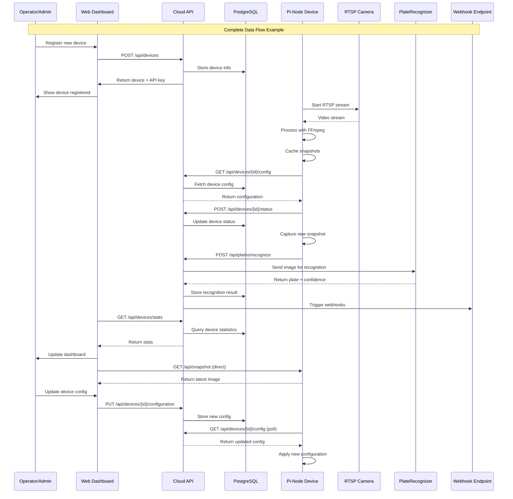
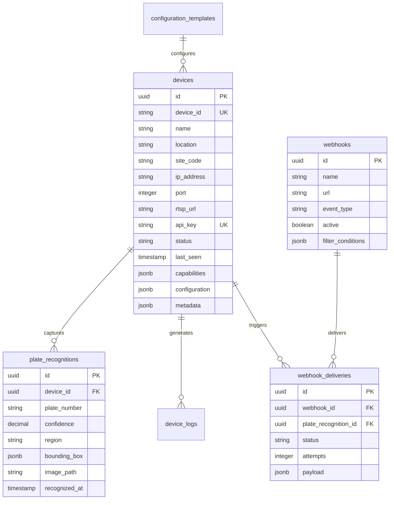
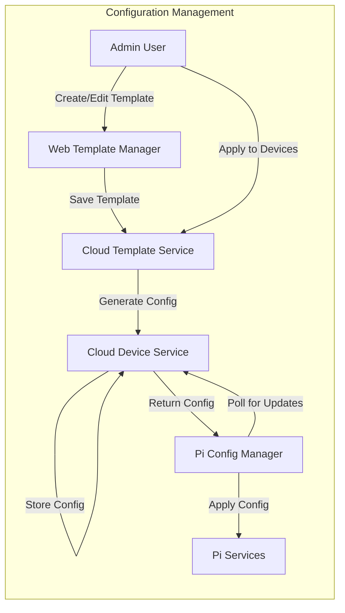
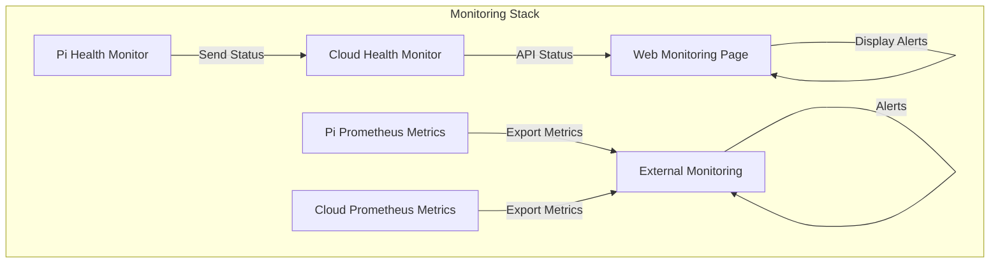
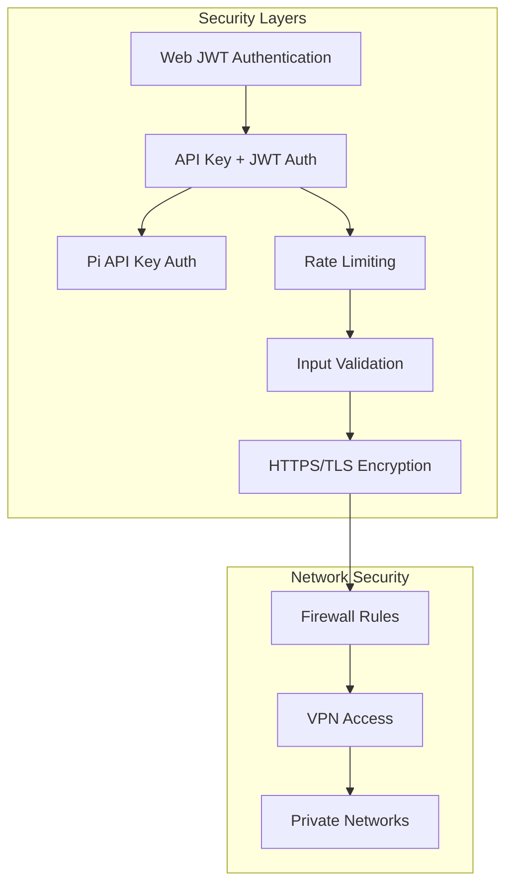
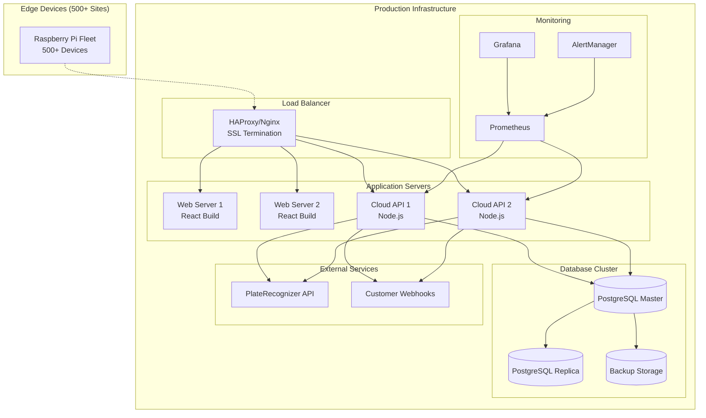

# CarWash Fleet Management - Complete Architecture (Phase 1 + Phase 2 + Web Frontend)

## 🏗️ **System Overview Diagram**

```mermaid
graph TB
    subgraph "🌐 Web Frontend (Phase 2.5)"
        WEB[Web Dashboard<br/>React + Ant Design]
        WEB_AUTH[Authentication]
        WEB_DASH[Dashboard]
        WEB_DEV[Device Management]
        WEB_PLATE[Plate Recognition]
        WEB_HOOK[Webhook Management]
        WEB_TEMP[Template Management]
        WEB_MON[Monitoring]
    end

    subgraph "☁️ Cloud API Server (Phase 2)"
        direction TB
        subgraph "🔌 API Layer"
            EXPRESS[Express.js Server<br/>Port 3003]
            AUTH_MW[Auth Middleware]
            RATE_MW[Rate Limiting]
            VALID_MW[Validation]
            ERROR_MW[Error Handler]
        end
        
        subgraph "🎛️ Controllers"
            DEV_CTRL[Device Controller]
            PLATE_CTRL[Plate Controller]
            WEBHOOK_CTRL[Webhook Controller]
            TEMP_CTRL[Template Controller]
            HEALTH_CTRL[Health Controller]
        end
        
        subgraph "⚙️ Core Services"
            DEV_SVC[Device Service]
            PLATE_SVC[Plate Service]
            WEBHOOK_SVC[Webhook Service]
            TEMP_SVC[Template Service]
            PLATEREC_SVC[PlateRecognizer Service]
        end
        
        subgraph "💾 Data Layer"
            POSTGRES[(PostgreSQL Database)]
            MIGRATIONS[Migration Files]
            SEEDS[Sample Data]
        end
        
        subgraph "📊 Monitoring"
            WINSTON[Winston Logger]
            PROMETHEUS[Prometheus Metrics]
            HEALTH_MON[Health Monitor]
        end
    end

    subgraph "🏭 Car Wash Locations (500+ Sites)"
        subgraph "📍 Site 1: Downtown Main"
            direction TB
            subgraph "🔧 Pi-Node Device (Phase 1)"
                PI1[Raspberry Pi 4<br/>Device ID: CAM-MAIN-001]
                PI1_API[Express API :3000]
                PI1_STREAM[Stream Manager]
                PI1_CACHE[Snapshot Cache]
                PI1_CONFIG[Config Manager]
                PI1_HEALTH[Health Monitor]
                PI1_FFMPEG[FFmpeg Process]
            end
            CAM1[📷 RTSP Camera<br/>rtsp://192.168.1.101:554]
            PI1_API --- PI1_STREAM
            PI1_STREAM --- PI1_CACHE
            PI1_STREAM --- PI1_FFMPEG
            PI1_FFMPEG --- CAM1
        end
        
        subgraph "📍 Site 2: North Plaza"
            direction TB
            subgraph "🔧 Pi-Node Device (Phase 1)"
                PI2[Raspberry Pi 4<br/>Device ID: CAM-NORTH-001]
                PI2_API[Express API :3000]
                PI2_STREAM[Stream Manager]
                PI2_CACHE[Snapshot Cache]
                PI2_CONFIG[Config Manager]
                PI2_HEALTH[Health Monitor]
                PI2_FFMPEG[FFmpeg Process]
            end
            CAM2[📷 RTSP Camera<br/>rtsp://192.168.2.101:554]
            PI2_API --- PI2_STREAM
            PI2_STREAM --- PI2_CACHE
            PI2_STREAM --- PI2_FFMPEG
            PI2_FFMPEG --- CAM2
        end
        
        subgraph "📍 Site N: 500+ More Sites"
            SITE_N[... 498 more sites<br/>Each with Pi + Camera]
        end
    end

    subgraph "🔗 External Services"
        PLATEREC_API[PlateRecognizer API<br/>api.platerecognizer.com]
        WEBHOOK_DEST[Webhook Destinations<br/>Customer APIs]
        MONITORING[External Monitoring<br/>Grafana/Prometheus]
    end

    %% Web Frontend Connections
    WEB --> EXPRESS
    WEB_AUTH --> AUTH_MW
    WEB_DASH --> DEV_CTRL
    WEB_DASH --> PLATE_CTRL
    WEB_DEV --> DEV_CTRL
    WEB_PLATE --> PLATE_CTRL
    WEB_HOOK --> WEBHOOK_CTRL
    WEB_TEMP --> TEMP_CTRL
    WEB_MON --> HEALTH_CTRL

    %% Cloud API Internal Connections
    EXPRESS --> AUTH_MW
    AUTH_MW --> RATE_MW
    RATE_MW --> VALID_MW
    VALID_MW --> DEV_CTRL
    VALID_MW --> PLATE_CTRL
    VALID_MW --> WEBHOOK_CTRL
    VALID_MW --> TEMP_CTRL
    VALID_MW --> HEALTH_CTRL
    
    DEV_CTRL --> DEV_SVC
    PLATE_CTRL --> PLATE_SVC
    WEBHOOK_CTRL --> WEBHOOK_SVC
    TEMP_CTRL --> TEMP_SVC
    HEALTH_CTRL --> HEALTH_MON
    
    DEV_SVC --> POSTGRES
    PLATE_SVC --> POSTGRES
    WEBHOOK_SVC --> POSTGRES
    TEMP_SVC --> POSTGRES
    
    PLATE_SVC --> PLATEREC_SVC
    PLATEREC_SVC --> PLATEREC_API
    
    WEBHOOK_SVC --> WEBHOOK_DEST
    
    %% Pi-Node to Cloud API Connections
    PI1_CONFIG -.->|Configuration Sync| DEV_SVC
    PI1_HEALTH -.->|Status Updates| DEV_SVC
    PI1_API -.->|Snapshot Upload| PLATE_SVC
    
    PI2_CONFIG -.->|Configuration Sync| DEV_SVC
    PI2_HEALTH -.->|Status Updates| DEV_SVC
    PI2_API -.->|Snapshot Upload| PLATE_SVC
    
    SITE_N -.->|All Sites Connect| EXPRESS

    %% Direct Pi Access from Web
    WEB -.->|Direct Snapshot Access| PI1_API
    WEB -.->|Direct Snapshot Access| PI2_API

    style WEB fill:#e1f5fe
    style EXPRESS fill:#f3e5f5
    style POSTGRES fill:#e8f5e8
    style PI1 fill:#fff3e0
    style PI2 fill:#fff3e0
    style PLATEREC_API fill:#fce4ec
```

## 🔄 **Data Flow Architecture**

## 🔗 **API Integration Points**

### **Phase 1 (Pi-Node) → Phase 2 (Cloud API)**

| Pi-Node Endpoint | Cloud API Endpoint | Purpose | Frequency |
|------------------|-------------------|---------|-----------|
| N/A | `GET /api/devices/{id}/config` | Configuration sync | Every 60s |
| N/A | `POST /api/devices/{device_id}/status` | Status heartbeat | Every 60s |
| N/A | `POST /api/plates/recognize` | Plate recognition | Per snapshot |
| N/A | `POST /api/device-logs` | Log forwarding | As needed |

### **Web Frontend → Cloud API**

| Frontend Page | API Endpoints | Purpose |
|---------------|---------------|---------|
| Dashboard | `GET /api/devices/stats`, `/api/plates/stats`, `/api/health/detailed` | Overview metrics |
| Devices | `GET /api/devices`, `POST /api/devices`, `PUT /api/devices/{id}` | Device management |
| Plates | `GET /api/plates`, `GET /api/plates/stats` | Recognition history |
| Webhooks | `GET /api/webhooks`, `POST /api/webhooks` | Webhook management |
| Templates | `GET /api/templates`, `POST /api/templates/{id}/apply` | Config templates |

### **Web Frontend → Pi-Node (Direct)**

| Purpose | Pi-Node Endpoint | Usage |
|---------|------------------|-------|
| Live snapshots | `GET /api/snapshot` | Real-time image display |
| Device health | `GET /api/health` | Direct device monitoring |
| Snapshot info | `GET /api/snapshot/info` | Camera status check |

## 📊 **Database Schema Integration**

## 🔧 **Configuration Flow**

## 🚨 **Monitoring & Alerting Flow**

## 🔐 **Security Architecture**

## 📋 **Deployment Architecture**

## 🔄 **Operational Workflows**

### **Device Onboarding**
1. Admin registers device in Web Dashboard
2. Cloud API generates unique API key and device configuration
3. Technician installs Pi-Node with device ID and API key
4. Pi-Node starts, connects to Cloud API, downloads configuration
5. Pi-Node begins streaming and reporting status
6. Device appears as "online" in Web Dashboard

### **Plate Recognition Pipeline**
1. Pi-Node captures snapshot from RTSP stream
2. Pi-Node sends snapshot to Cloud API `/api/plates/recognize`
3. Cloud API forwards image to PlateRecognizer service
4. PlateRecognizer returns plate number and confidence
5. Cloud API stores result in database
6. Cloud API triggers configured webhooks
7. Results appear in Web Dashboard plate recognition page

### **Configuration Management**
1. Admin creates configuration template in Web Dashboard
2. Admin selects devices and applies template with variables
3. Cloud API generates device-specific configurations
4. Pi-Nodes poll for configuration updates
5. Pi-Nodes apply new configurations and restart services
6. Status updates confirm successful configuration changes

This architecture provides a complete, scalable, and maintainable fleet management system for 500+ car wash locations with real-time monitoring, automated plate recognition, and centralized management capabilities.