# CarWash Fleet Management - Complete System Integration

## 🌐 **Pi-Node + Cloud API + 3rd Party Services Integration**

```mermaid
graph TB
    subgraph "🏭 Car Wash Sites (500+ Locations)"
        subgraph "📍 Site 1"
            subgraph "🔧 Pi-Node Device"
                PI1[Raspberry Pi 4<br/>CAM-MAIN-001]
                PI1_STREAM[Stream Manager]
                PI1_CACHE[Snapshot Cache]
                PI1_CONFIG[Config Manager]
                PI1_HEALTH[Health Monitor]
                PI1_PLATE[Plate Integration]
            end
            CAM1[📷 RTSP Camera<br/>192.168.1.101:554]
        end
        
        subgraph "📍 Site 2"
            subgraph "🔧 Pi-Node Device"
                PI2[Raspberry Pi 4<br/>CAM-NORTH-001]
                PI2_STREAM[Stream Manager]
                PI2_CACHE[Snapshot Cache]
            end
            CAM2[📷 RTSP Camera<br/>192.168.2.101:554]
        end
        
        SITE_N[📍 Sites 3-500<br/>Additional Pi-Nodes]
    end

    subgraph "☁️ Cloud Infrastructure"
        subgraph "🌐 Web Frontend"
            WEB[React Dashboard<br/>Port 3000]
            WEB_DASH[Live Dashboard]
            WEB_DEV[Device Management]
            WEB_PLATE[Plate History]
            WEB_HOOK[Webhook Config]
        end
        
        subgraph "🔌 Cloud API Server"
            API[Express.js Server<br/>Port 3003]
            API_DEV[Device Service]
            API_PLATE[Plate Service]
            API_WEBHOOK[Webhook Service]
            API_AUTH[Authentication]
        end
        
        subgraph "💾 Database"
            POSTGRES[(PostgreSQL<br/>Fleet Data)]
        end
    end

    subgraph "🔗 3rd Party Services"
        subgraph "🤖 AI/ML Services"
            PLATEREC[PlateRecognizer API<br/>api.platerecognizer.com]
            PLATEREC_SDK[PlateRecognizer SDK]
            AI_MODELS[Custom AI Models<br/>Optional]
        end
        
        subgraph "📡 Webhook Destinations"
            CUSTOMER_API1[Customer API 1<br/>carwash-corp.com/api]
            CUSTOMER_API2[Customer API 2<br/>fleet-management.com]
            SLACK_WEBHOOK[Slack Notifications]
            EMAIL_SERVICE[Email Alerts]
        end
        
        subgraph "📊 Monitoring & Analytics"
            PROMETHEUS[Prometheus Metrics]
            GRAFANA[Grafana Dashboards]
            ALERTMANAGER[Alert Manager]
            EXTERNAL_LOG[External Logging<br/>ELK Stack]
        end
        
        subgraph "☁️ Cloud Storage"
            S3_STORAGE[AWS S3<br/>Image Storage]
            BACKUP_STORAGE[Backup Storage]
        end
    end

    %% Pi-Node Internal Connections
    CAM1 -->|RTSP Stream| PI1_STREAM
    PI1_STREAM -->|Snapshots| PI1_CACHE
    PI1_CACHE -->|Triggers| PI1_PLATE
    
    CAM2 -->|RTSP Stream| PI2_STREAM
    PI2_STREAM -->|Snapshots| PI2_CACHE

    %% Pi-Node to Cloud API Connections
    PI1_CONFIG -.->|GET /api/devices/{id}/config<br/>Every 60s| API_DEV
    PI1_HEALTH -.->|POST /api/devices/{id}/status<br/>Every 60s| API_DEV
    PI1_PLATE -.->|POST /api/plates/recognize<br/>Per snapshot| API_PLATE
    
    PI2 -.->|Same API calls| API
    SITE_N -.->|500+ devices connecting| API

    %% Cloud API Internal Connections
    API_DEV --> POSTGRES
    API_PLATE --> POSTGRES
    API_WEBHOOK --> POSTGRES
    
    %% Cloud API to 3rd Party Services
    API_PLATE -->|Image + Metadata| PLATEREC
    PLATEREC -->|Plate + Confidence| API_PLATE
    
    API_WEBHOOK -->|Webhook Delivery| CUSTOMER_API1
    API_WEBHOOK -->|Webhook Delivery| CUSTOMER_API2
    API_WEBHOOK -->|Notifications| SLACK_WEBHOOK
    API_WEBHOOK -->|Alerts| EMAIL_SERVICE
    
    API -->|Store Images| S3_STORAGE
    API -->|Metrics Export| PROMETHEUS
    API -->|Log Export| EXTERNAL_LOG
    
    %% Web Frontend Connections
    WEB -->|REST API Calls| API
    WEB_DASH -->|Live Data| API_DEV
    WEB_DEV -->|Device Management| API_DEV
    WEB_PLATE -->|Recognition History| API_PLATE
    WEB_HOOK -->|Webhook Config| API_WEBHOOK
    
    %% Direct Pi Access from Web
    WEB -.->|Direct Snapshot<br/>GET /api/snapshot| PI1
    WEB -.->|Direct Health Check<br/>GET /api/health| PI1
    
    %% Monitoring Connections
    PROMETHEUS -->|Scrape Metrics| API
    PROMETHEUS -.->|Scrape Metrics| PI1
    GRAFANA -->|Visualize| PROMETHEUS
    ALERTMANAGER -->|Process Alerts| PROMETHEUS
    
    %% Backup and Storage
    POSTGRES -->|Automated Backup| BACKUP_STORAGE
    S3_STORAGE -->|Replication| BACKUP_STORAGE

    %% Styling
    style PI1 fill:#fff3e0,stroke:#ff9800
    style PI2 fill:#fff3e0,stroke:#ff9800
    style API fill:#e8f5e8,stroke:#4caf50
    style WEB fill:#e3f2fd,stroke:#2196f3
    style POSTGRES fill:#f3e5f5,stroke:#9c27b0
    style PLATEREC fill:#fce4ec,stroke:#e91e63
    style PROMETHEUS fill:#fff8e1,stroke:#ffc107
```

## 🔄 **Complete Data Flow Sequence**

```mermaid
sequenceDiagram
    participant Cam as RTSP Camera
    participant Pi as Pi-Node Device
    participant API as Cloud API
    participant DB as PostgreSQL
    participant PR as PlateRecognizer
    participant WH as Customer Webhook
    participant Web as Web Dashboard
    participant Mon as Monitoring
    participant Store as Cloud Storage

    Note over Cam, Store: Complete Integration Flow

    %% 1. System Initialization
    Pi->>API: POST /api/devices (register)
    API->>DB: Store device registration
    API-->>Pi: Device ID + API Key
    
    %% 2. Configuration Sync
    Pi->>API: GET /api/devices/{id}/config
    API->>DB: Fetch device configuration
    API-->>Pi: Configuration JSON
    Pi->>Pi: Apply configuration & restart services
    
    %% 3. Stream Processing & Health Monitoring
    Cam->>Pi: RTSP video stream
    Pi->>Pi: FFmpeg processing → snapshots
    Pi->>Pi: Cache snapshots in memory
    
    Pi->>API: POST /api/devices/{id}/status
    API->>DB: Update device status & metadata
    API->>Mon: Export metrics to Prometheus
    
    %% 4. Plate Recognition Pipeline
    Pi->>Pi: New snapshot captured
    Pi->>API: POST /api/plates/recognize (image upload)
    API->>Store: Store original image
    API->>PR: Forward image to PlateRecognizer
    PR-->>API: Plate number + confidence
    API->>DB: Store recognition result
    
    %% 5. Webhook Delivery
    API->>API: Check webhook conditions
    API->>WH: POST webhook payload
    WH-->>API: HTTP 200 OK
    API->>DB: Log webhook delivery success
    
    %% 6. Web Dashboard Updates
    Web->>API: GET /api/devices/stats
    API->>DB: Query device statistics
    API-->>Web: Dashboard data
    
    Web->>Pi: GET /api/snapshot (direct)
    Pi-->>Web: Latest snapshot image
    
    %% 7. Real-time Monitoring
    Mon->>API: Scrape /metrics endpoint
    Mon->>Pi: Scrape /metrics endpoint
    Mon->>Mon: Process metrics & alerts
    
    %% 8. Backup & Storage
    API->>Store: Periodic backup images
    DB->>Store: Database backup
```



## 🔌 **API Integration Details**

### **Pi-Node → Cloud API Communication**

| Endpoint | Method | Purpose | Frequency | Authentication |
|----------|--------|---------|-----------|----------------|
| `/api/devices/{device_id}/config` | GET | Configuration sync | Every 60s | API Key |
| `/api/devices/{device_id}/status` | POST | Health reporting | Every 60s | API Key |
| `/api/plates/recognize` | POST | Plate recognition | Per snapshot | API Key |
| `/api/device-logs` | POST | Log forwarding | As needed | API Key |

### **Cloud API → 3rd Party Services**

| Service | Endpoint | Purpose | Trigger |
|---------|----------|---------|---------|
| PlateRecognizer | `POST /v1/plate-reader/` | License plate detection | New snapshot |
| Customer Webhooks | `POST {customer_url}` | Event notifications | Plate recognized |
| Prometheus | `GET /metrics` | Metrics scraping | Every 30s |
| AWS S3 | `PUT /bucket/images/` | Image storage | New recognition |

### **Web Frontend → Cloud API**

| Feature | Endpoints | Real-time Updates |
|---------|-----------|-------------------|
| Dashboard | `GET /api/devices/stats`, `/api/plates/stats` | Every 30s |
| Device Management | `GET /api/devices`, `POST /api/devices` | On demand |
| Live Snapshots | Direct to Pi-Node `GET /api/snapshot` | Every 5s |
| Plate History | `GET /api/plates?limit=100` | Every 60s |
| Webhook Config | `GET /api/webhooks`, `POST /api/webhooks` | On demand |

## 📊 **Data Exchange Formats**

### **Configuration Sync (Cloud API → Pi-Node)**
```json
{
  "success": true,
  "configuration": {
    "stream": {
      "rtspUrl": "rtsp://192.168.1.101:554/stream1",
      "rtspTransport": "tcp",
      "timeout": 30000,
      "reconnectDelay": 5000
    },
    "snapshot": {
      "interval": 10,
      "quality": 3,
      "cacheSize": 10
    },
    "plateRecognition": {
      "enabled": true,
      "minConfidence": 0.7,
      "regions": ["us", "ca"]
    },
    "cloud": {
      "apiUrl": "https://api.carwash-fleet.com",
      "syncInterval": 60000
    }
  }
}
```

### **Status Report (Pi-Node → Cloud API)**
```json
{
  "status": "online",
  "metadata": {
    "cpu_usage": 45.2,
    "memory_usage": 67.8,
    "disk_usage": 23.1,
    "temperature": 52.3,
    "uptime": 86400,
    "stream_status": "healthy",
    "last_snapshot": "2024-12-07T10:29:55Z",
    "snapshot_count": 1440,
    "error_count": 0
  }
}
```

### **Plate Recognition (Pi-Node → Cloud API → PlateRecognizer)**
```json
{
  "success": true,
  "data": {
    "id": "recognition-uuid",
    "plate_number": "ABC123",
    "confidence": 0.95,
    "region": "us",
    "bounding_box": {
      "x": 100, "y": 50, "width": 200, "height": 80
    },
    "device_id": "CAM-MAIN-001",
    "recognized_at": "2024-12-07T10:30:00Z",
    "image_url": "https://s3.amazonaws.com/carwash-images/..."
  }
}
```

### **Webhook Payload (Cloud API → Customer)**
```json
{
  "event": "plate_recognized",
  "timestamp": "2024-12-07T10:30:00Z",
  "data": {
    "plate_number": "ABC123",
    "confidence": 0.95,
    "device": {
      "id": "CAM-MAIN-001",
      "name": "Main Entrance Camera",
      "location": "Downtown Main Car Wash"
    },
    "image_url": "https://s3.amazonaws.com/carwash-images/...",
    "recognized_at": "2024-12-07T10:30:00Z"
  },
  "metadata": {
    "webhook_id": "webhook-uuid",
    "delivery_id": "delivery-uuid"
  }
}
```

## 🔐 **Security & Authentication Flow**


## 📈 **Monitoring & Alerting Integration**


## 🚀 **Deployment Architecture**


This comprehensive integration diagram shows how all components work together to create a complete, scalable fleet management system capable of handling 500+ car wash locations with real-time plate recognition, monitoring, and management capabilities.