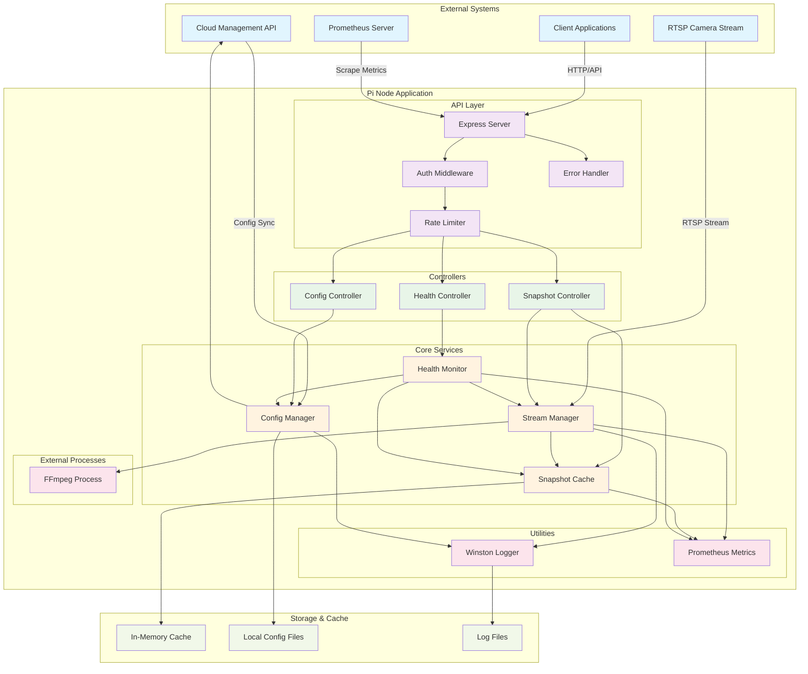
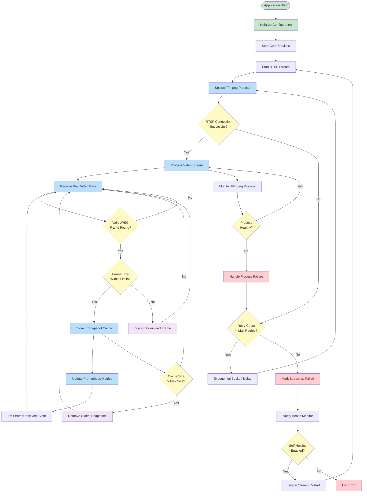
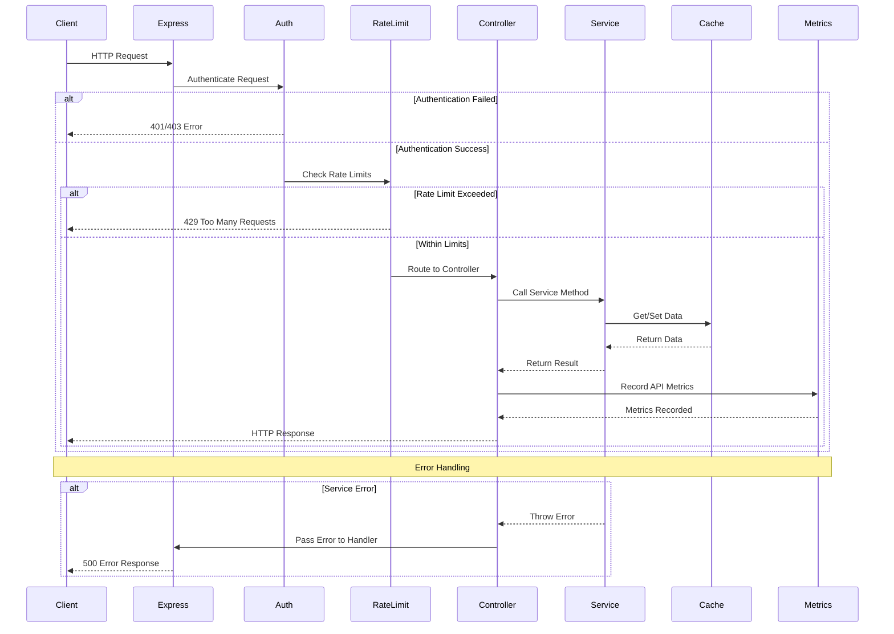
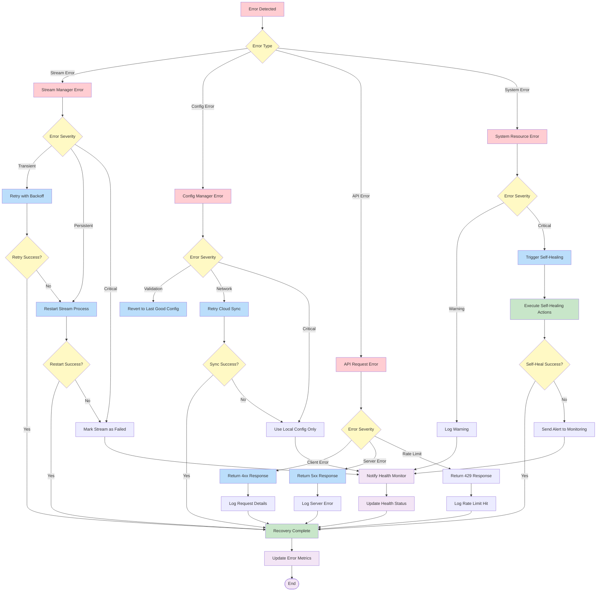
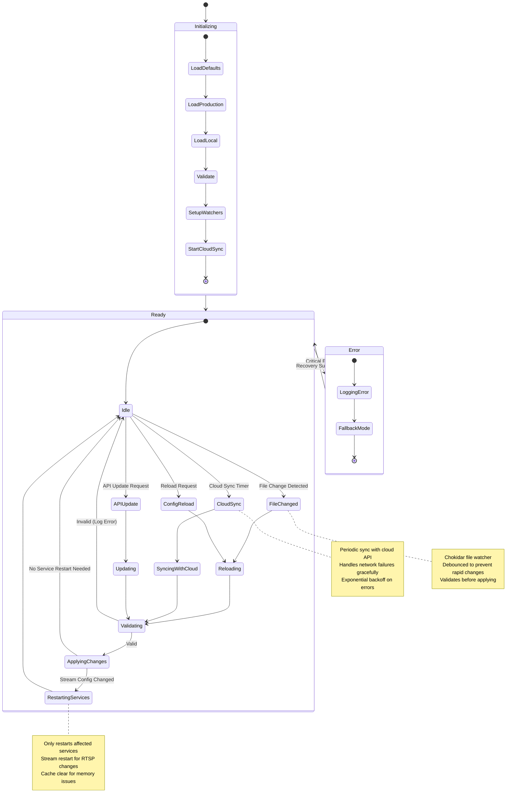
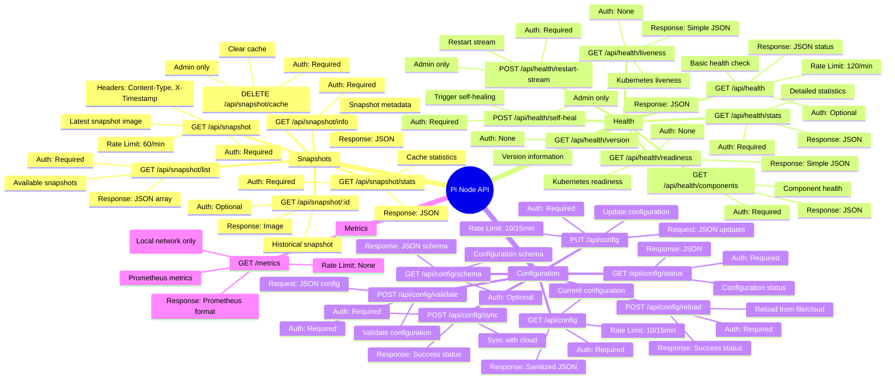

# Car Wash Pi Node - Architecture Diagrams

This document contains comprehensive diagrams showing the data flow, API interactions, and service architecture for the Car Wash Pi Node application.

## 1. Overall System Architecture



## 2. Data Flow Diagram - RTSP Stream Processing



## 3. API Request Flow



## 4. Service Interaction Pattern

```mermaid
graph LR
    subgraph "Initialization Phase"
        A1[ConfigManager.initialize] --> A2[Load Default Config]
        A2 --> A3[Load Local Config]
        A3 --> A4[Validate Config]
        A4 --> A5[Setup File Watcher]
        A5 --> A6[Start Cloud Sync]
    end

    subgraph "Service Startup"
        B1[StreamManager.start] --> B2[Spawn FFmpeg]
        B2 --> B3[Setup Event Handlers]
        B3 --> B4[Start Processing]
        
        C1[HealthMonitor.start] --> C2[Collect System Metrics]
        C2 --> C3[Monitor Services]
        C3 --> C4[Check Health Status]
    end

    subgraph "Runtime Operations"
        D1[Receive RTSP Data] --> D2[Process Video Frame]
        D2 --> D3[Store Snapshot]
        D3 --> D4[Update Cache]
        D4 --> D5[Record Metrics]
        D5 --> D1
        
        E1[API Request] --> E2[Authenticate]
        E2 --> E3[Get Cached Snapshot]
        E3 --> E4[Return Response]
        E4 --> E5[Log Request]
    end

    subgraph "Health & Monitoring"
        F1[Periodic Health Check] --> F2[Check Stream Status]
        F2 --> F3[Check System Resources]
        F3 --> F4[Evaluate Overall Health]
        F4 --> F5{Issues Detected?}
        F5 -->|Yes| F6[Trigger Self-Healing]
        F5 -->|No| F1
        F6 --> F7[Restart Services]
        F7 --> F1
    end

    subgraph "Configuration Management"
        G1[Config Change Detected] --> G2[Reload Configuration]
        G2 --> G3[Validate New Config]
        G3 --> G4[Apply Changes]
        G4 --> G5[Restart Affected Services]
        G5 --> G6[Emit Config Updated Event]
    end

    %% Inter-service connections
    A6 -.-> G1
    B4 -.-> D1
    C4 -.-> F1
    D3 -.-> E3
    G5 -.-> B1

    %% Styling
    classDef init fill:#e3f2fd
    classDef startup fill:#e8f5e8
    classDef runtime fill:#fff3e0
    classDef health fill:#fce4ec
    classDef config fill:#f3e5f5

    class A1,A2,A3,A4,A5,A6 init
    class B1,B2,B3,B4,C1,C2,C3,C4 startup
    class D1,D2,D3,D4,D5,E1,E2,E3,E4,E5 runtime
    class F1,F2,F3,F4,F5,F6,F7 health
    class G1,G2,G3,G4,G5,G6 config
```



## 5. Error Handling and Recovery Flow



## 6. Configuration Management Flow



## 7. Metrics and Monitoring Data Flow

```mermaid
flowchart LR
    subgraph "Data Sources"
        Stream[Stream Manager]
        Cache[Snapshot Cache]
        API[API Requests]
        System[System Info]
        Health[Health Monitor]
    end

    subgraph "Metrics Collection"
        StreamMetrics[Stream Metrics<br/>• Process Status<br/>• Frame Rate<br/>• Restart Count]
        CacheMetrics[Cache Metrics<br/>• Hit Rate<br/>• Size<br/>• Operations]
        APIMetrics[API Metrics<br/>• Request Count<br/>• Response Time<br/>• Error Rate]
        SystemMetrics[System Metrics<br/>• CPU Usage<br/>• Memory<br/>• Temperature]
        HealthMetrics[Health Metrics<br/>• Component Status<br/>• Issue Count<br/>• Recovery Actions]
    end

    subgraph "Metrics Storage"
        PrometheusClient[Prometheus Client]
        MetricsEndpoint[/metrics Endpoint]
    end

    subgraph "External Monitoring"
        PromServer[Prometheus Server]
        Grafana[Grafana Dashboard]
        Alerting[Alert Manager]
    end

    %% Data flow
    Stream --> StreamMetrics
    Cache --> CacheMetrics
    API --> APIMetrics
    System --> SystemMetrics
    Health --> HealthMetrics

    StreamMetrics --> PrometheusClient
    CacheMetrics --> PrometheusClient
    APIMetrics --> PrometheusClient
    SystemMetrics --> PrometheusClient
    HealthMetrics --> PrometheusClient

    PrometheusClient --> MetricsEndpoint
    MetricsEndpoint --> PromServer
    PromServer --> Grafana
    PromServer --> Alerting

    %% Feedback loop
    Alerting -.->|Webhook| Health
    Health -.->|Self-Healing| Stream

    %% Styling
    classDef source fill:#e3f2fd
    classDef collection fill:#e8f5e8
    classDef storage fill:#fff3e0
    classDef external fill:#fce4ec

    class Stream,Cache,API,System,Health source
    class StreamMetrics,CacheMetrics,APIMetrics,SystemMetrics,HealthMetrics collection
    class PrometheusClient,MetricsEndpoint storage
    class PromServer,Grafana,Alerting external
```

## 8. API Endpoint Map



These diagrams provide a comprehensive view of the Pi Node architecture, showing how data flows through the system, how components interact, and how errors are handled. The diagrams use standard Mermaid syntax and can be rendered in any Markdown viewer that supports Mermaid diagrams.